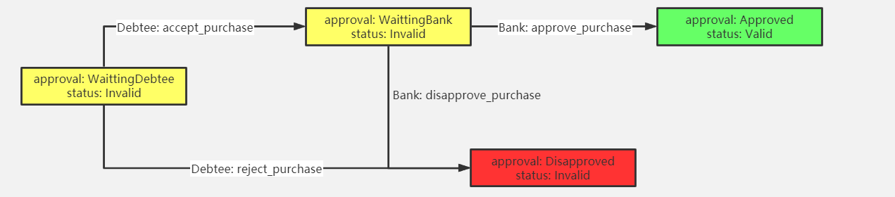
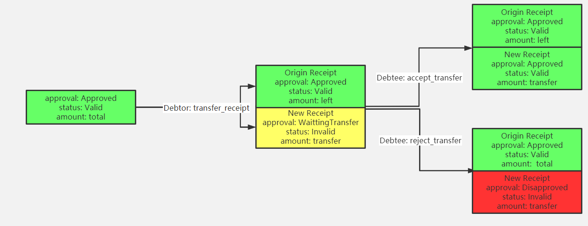
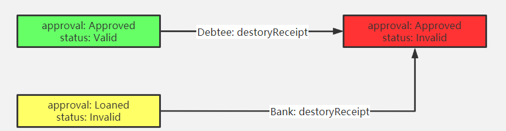

<h1 align=center> 区块链大作业实验报告 </h1>

[toc]

## 实现功能

基于已有的开源区块链系统FISCO-BCOS（https://github.com/FISCO-BCOS/FISCO-BCOS），以联盟链为主，开发基于区块链或区块链智能合约的供应链金融平台，实现**供应链应收账款资产的溯源、流转**。

将供应链上的每一笔交易和应收账款单据上链，同时引入第三方可信机构来确认这些信息的交易，例如银行，物流公司等，确保交易和单据的真实性。同时，支持应收账款的转让，融资，清算等，让核心企业的信用可以传递到供应链的下游企业，减小中小企业的融资难度。

具体实现功能：

1. 实现采购商品—签发应收账款 交易上链。例如车企从轮胎公司购买一批轮胎并签订应收账款单据。
2. 实现应收账款的转让上链，轮胎公司从轮毂公司购买一笔轮毂，便将于车企的应收账款单据部分转让给轮毂公司。轮毂公司可以利用这个新的单据去融资或者要求车企到期时归还钱款。
3. 利用应收账款向银行融资上链，供应链上所有可以利用应收账款单据向银行申请融资。
4. 应收账款支付结算上链，应收账款单据到期时核心企业向下游企业支付相应的欠款。
5. *信用度系统。


## 组员分工

18340081 金钰 ：智能合约、前端、第三阶段实验报告

18340076 黄子聿 ：数据库、后端

18340071 黄榆竣 ：前端、第二阶段实验报告


## 智能合约设计

在原有的4个基础功能上增加了信用度系统。该系统是第三方机构（银行）对企业评级的体现，较高的信用度对应较高的还款能力与还款信用。拥有较高信用度的企业可以与下游企业签订金额数目更大的Receipt。第三方机构（银行）可以根据企业对每一个Receipt的还款请款实时调整该企业的信用度。因信用度不足导致银行无法批准Receipt的情景在演示视频里有所体现。

智能合约的演示详见功能测试文档及演示视频。

- receipt结构体

```c++
struct Receipt {
    uint amount;        //金额
    address debtor;     //债务人
    address debtee;     //债权人
    uint start_time;        //单据签订时间
    uint duration;      //债务有效期
    string remark;      //单据备注
    e_ApproveStatus approval;       //单据当前审批状态
    e_ReceiptStatus status;     //单据当前是否可用于交易
}

```

- 公共变量

```c
address public bank;        //第三方机构（银行）
mapping(uint => Receipt) receipts;      //由序号索引的单据
uint receipt_num;       //总单据数量
mapping(address => uint) reputations;       //企业信誉度
address[] enterprises;      //已向第三方注册的企业
```

- 公有方法

```c
//企业向第三方信用机构注册自己
function register() public returns (bool success) 

//第三方信用机构对企业的信用进行评级
function set_reputation(address user, uint value) public returns (bool success) 

//信用度对应的最大应收账款单据额度
function limit_amount_by_reputation(uint reputation) public returns (uint amount)

//判断企业的信用度是否足够使第三方信用机构同意由其发起的应收账款单据
function enough_reputation(address user, uint amount) public returns (bool) 

//企业debtor向企业debtee发起签署应收账款单据
function purchase(address debtee, uint amount, uint duration, string remark) public returns (uint index) 

//企业debtee同意企业debtor发起的应收账款单据
function accept_purchase(uint indexOfReceipt) public 

//企业debtee拒绝企业debtor发起的应收账款单据
function reject_purchase(uint indexOfReceipt) public 

//第三方信用机构批准由企业debtor发起，经企业debtee同意的应收账款单据
function approve_purchase(uint indexOfReceipt) public 

//第三方信用机构拒绝由企业debtor发起，经企业debtee同意的应收账款单据
function disapprove_purchase(uint indexOfReceipt) public 

//应收账款单据的debtee向一个新的企业转让其持有的应收账款单据的部分或全部额度
function transfer_receipt(address debtee, uint indexOfReceipt, uint amount, string remark) public returns (uint indexOfOriginReceipt, uint indexOfNewReceipt) 

//检查两个应收账款单据是否同源
function from_same_receipt(uint index1, uint index2) public returns (bool) 

//新的企业同意应收账款单据的转让
function accept_transfer(uint indexOfOriginReceipt, uint indexOfNewReceipt) public 

//新的企业拒绝应收账款单据的转让
function reject_transfer(uint indexOfOriginReceipt, uint indexOfNewReceipt) public 

//企业依据其持有的应收账款单据向银行贷款
function loan(uint indexOfReceipt) public 

//在应收账款单据的债务人缴清费用后删除该单据
function destoryReceipt(uint indexOfReceipt) public returns (bool success) 

```

### receipt状态变化说明

四个基本功能的FSM如下面各图所示。其中方框中为Receipt的当前状态，`User：Method`为发生状态转移时对应的用户及其操作。

#### 发起receipt



#### 转让receipt



#### 使用receipt融资


#### 销毁receipt


## 关于前后端

整体设计思路如图


其中`BC API`使用WeBase提供的工具https://github.com/WeBankBlockchain/Data-Export，数据库使用mySQL，前端使用express框架。出于种种原因，前端未能如期完成，只完成了一部分。